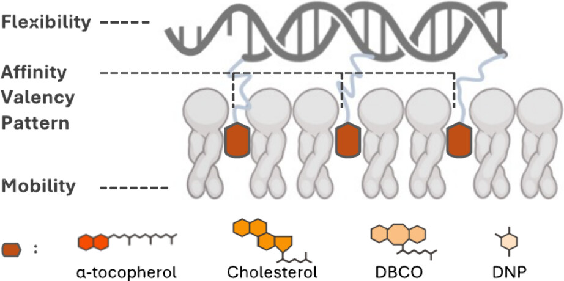

# NA-Lipid Interface Analysis: Multivalent Hydrophobicity

[](https://pubs.acs.org/doi/full/10.1021/acs.nanolett.4c02564)
[](https://opensource.org/licenses/MIT)

This repository contains the official computational pipeline for quantifying the binding affinity of DNA nanostructures to lipid membranes through multivalent hydrophobic anchoring.

---

## 📝 Publication

This code was developed and validated for the analysis presented in:

> **Modulating the DNA/Lipid Interface through Multivalent Hydrophobicity** > *Siu Ho Wong et al.* > **Nano Letters 2024** 24 (36), 11210–11218
> [Read the full paper here](https://doi.org/10.1021/acs.nanolett.4c02564)

## 🏆 Visual Recognition: Nano Letters Cover Art

The biophysical principles explored in this work were featured as the **Supplementary Journal Cover** for *Nano Letters* (September 11, 2024, Volume 24, Issue 36).

<p align="center">


<em>Figure 1: Journal Cover Art for Nano Letters, Volume 24, Issue 36.</em>
</p>

<p align="center">



<em>Figure 2: Graphical abstract illustrating the modulation of DNA/Lipid interfaces via multivalent hydrophobic anchors.</em>
</p>
---

## 🔬 Scientific Context

This research establishes a framework for the phase-independent attachment of DNA to zwitterionic lipid bilayers. By leveraging hydrophobic anchoring rather than electrostatic bridging, we quantified a **multivalency effect** where binding strength is tuned by anchor density and structural orientation. This repository provides the tools to measure these interactions quantitatively from confocal microscopy data.

## 🚀 Automated Analysis Pipeline

The pipeline is designed to extract precise membrane-bound fluorescence intensities while adhering to strict quality control criteria:

* **Vesicle Screening:** Automated exclusion of out-of-focus GUVs, lipid aggregates ("clumps"), and vesicles touching image boundaries.
* **Preprocessing:** Dual-channel (NBD Lipid / Cy5 DNA) Gaussian smoothing for noise reduction.
* **Segmentation:** Multi-population **Otsu thresholding** combined with a closing operator for robust membrane binarization.
* **Skeletonization:** Implementing **Watershed transformation** to generate 1-pixel wide masks, ensuring fluorescence sampling is restricted to the membrane contour.
* **Quantification:** Calculation of background-subtracted mean and median Cy5 intensities for each detected GUV.

---

## ⚙️ Setup & Usage

### 1. Requirements

* **Python 3.10+**
* Libraries: `numpy`, `pandas`, `opencv-python`, `scikit-image`, `matplotlib`, `scipy`

### 2. Installation

```bash
git clone https://github.com/Herbert-Wong25/DNA-Lipid_Multivalent_Hydrophobicity_Analysis.git
cd DNA-Lipid_Multivalent_Hydrophobicity_Analysis
pip install -r requirements.txt

```

### 3. Folder Setup & Execution

The pipeline utilizes **relative path handling** for portability.

* Place raw confocal `.ome.tif` files in **`/data/raw`**. Subfolders must contain `-d84` in the name.
* Open and run **`GUV_Multivalent_Analysis_Pipeline.ipynb`** in Jupyter.
* Quantitative results and visualization plots will be exported to **`/data/processed`**.

---

## 📂 Project Structure

* **`/notebooks`**: Cleaned and documented analysis pipeline.
* **`/data/raw`**: Input directory for microscopy data.
* **`/data/processed`**: Output directory for CSV results and labeled masks.
* **`/assets`**: Contains Graphical Abstract and Nano Letters Cover Art.

## 🛠 Adjustable Parameters

* `sigma`: Gaussian blur intensity for noise reduction.
* `classes`: Number of populations for multi-Otsu thresholding.
* `min_size`: Filter to exclude small artifacts or debris.

---

## ✉️ Contact

For questions regarding the methodology or requests for raw datasets, please contact **(Herbert) Siu-Ho Wong** at [herbert.wong150@gmail.com].

---
